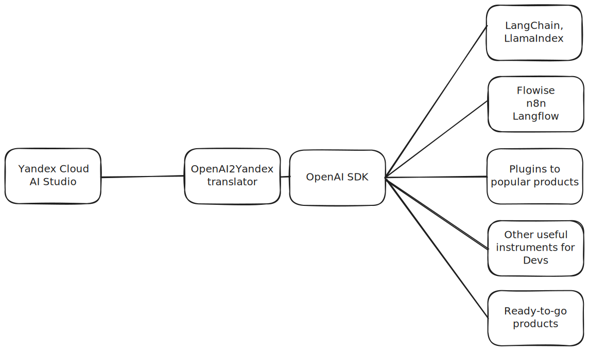

# OpenAI to Yandex GPT API Adapter

**Use Yandex Cloud models from anywhere!**

ГОЛОСОВАЛКА

Данное приложение преобразует API-запросы формата OpenAI в запросы формата Yandex Cloud Foundational Models, что позволяет использовать Yandex Cloud Foundational Models через OpenAI SDK.

Сценарии использования:

- 🤖 работа с моделями Yandex Cloud через OpenAI SDK на любом языке программирования
- 🚀 разработка с моделями Yandex Cloud в no-code фреймворках широкого профиля (n8n, langflow, flowise и т.д.)
- 🦜 разработка с моделями Yandex Cloud на Open Source фреймворках (langchain, llamaindex)
- 🛫 использование моделей Yandex Cloud в пользовательских приложениях (например, различные плагины для Obsidian, Notion и т.д.)

:::info

Используя данный адаптер, вы можете за несколько кликов подключить любую модель Yandex Cloud к любому готовому приложению,
написанному на технологиях OpenAI. Это позволяет значительно ускорить разработку и не заниматься написанием бойлерплейт-кода.

:::

*Данный проект не является официальным продуктом Yandex Cloud. Поддерживается командой ai-cookbook.ru.*
