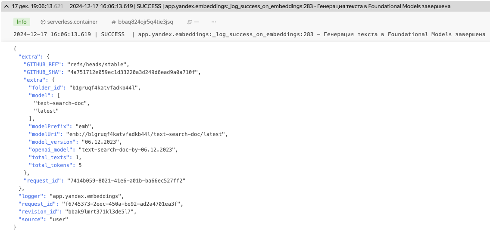
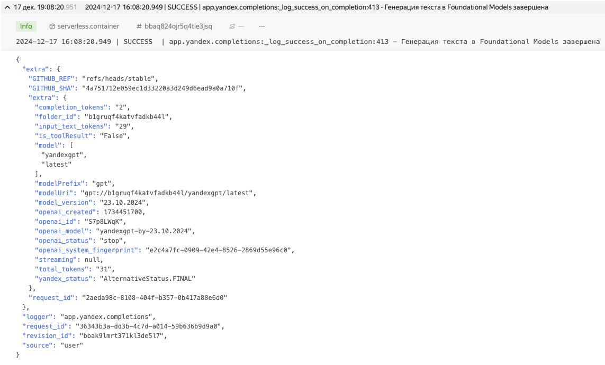

# Публичные эндпоинты

## Список

1. **Stable** `Yandex Cloud, on-edge`  
    * (рекомендуется) https://o2y.ai-cookbook.ru/v1
2. **Latest** `Yandex Cloud, on-edge`  
    * https://latest.o2y.ai-cookbook.ru/v1
3. **Latest** `Vercel, Stockholm`  
    * https://openai-yandexgpt-adapter.vercel.app/v1

Готовые адаптеры развернуты на бессерверной инфраструктуре Yandex Cloud и способны выдерживать большое количество запросов. 

Также вы можете [развернуть адаптер на своей инфраструктуре](deploy.mdx).

## Про безопасность и стабильность

### Стабильность

Сервис развернут на Yandex Cloud с использованием бессерверной инфраструктуры, что гарантирует стабильную работу сервиса под любой нагрузкой:
- serverless container
- api gateway
- ddos protection
- monitoring
- logging
- alerting

Просмотреть историю доступности сервиса можно [на странице](https://ai-cookbook-ru.cronitorstatus.com/)

### Сбор открытой информации

Мы собираем нечуствительную информацию **для улучшения работы адаптера:**
- код адаптера и CD доступны на github, вы можете сравнить github sha 
[тут](https://github.com/ai-cookbook/openai-yandexgpt-adapter/commit/stable)
 и [тут](https://o2y.ai-cookbook.ru/docs) сверху страницы
- на публичных эндпоинтах выставлен режим логирования `INFO` исключительно для подсчета количества запросов
- содержание запросов и ответов 100% не логируется
- api-ключи не логируются, в случае ошибки [проходят обфускацию](https://github.com/ai-cookbook/openai-yandexgpt-adapter/blob/main/app/yandex/yc_log_handler.py)

Примеры информации, которая собирается

