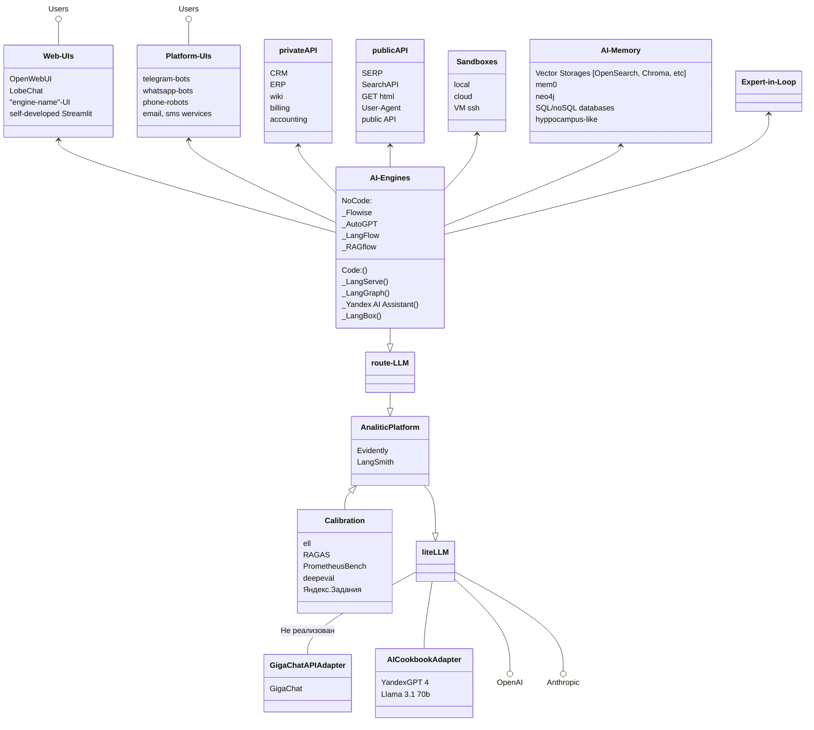

# Про AI System Design

```mermaid
classDiagram

class Web-UIs {
    OpenWebUI
    LobeChat
    "engine-name"-UI
    self-developed Streamlit
}

class Platform-UIs {
    telegram-bots
    whatsapp-bots
    phone-robots
    email, sms wervices
}

class private API {
    CRM
    ERP
    wiki
    billing
    accounting
}

class public API {
    SERP
    SearchAPI
    GET html
    User-Agent
    public API
}

class Sandboxes {
    local
    cloud
    VM ssh
}

class Calibration {
    ell
    RAGAS
    PrometheusBench
    deepeval
    Яндекс.Задания
}

class AI-Engines {
    NoCode:
    _Flowise
    _AutoGPT
    _LangFlow
    _RAGflow

    Code: ()
    _LangServe()
    _LangGraph()
    _Yandex AI Assistant()
    _LangBox()
}

class AI-Memory {
    Vector Storages [OpenSearch, Chroma, etc]
    mem0
    neo4j
    SQL/noSQL databases
    hyppocampus-like
}

class Analitic Platform {
    Evidently
    LangSmith
}

Users ()-- Web-UIs
Users ()-- Platform-UIs

Web-UIs <-- AI-Engines
Platform-UIs <-- AI-Engines
private API <-- AI-Engines
public API <-- AI-Engines
Sandboxes <-- AI-Engines
AI-Memory <-- AI-Engines
Expert-in-Loop <-- AI-Engines

AI-Engines --|> route-LLM

Analitic Platform <|-- Calibration

route-LLM --|> Analitic Platform
Analitic Platform --|> liteLLM
liteLLM -- GigaChat API Adapter : Не реализован
liteLLM -- AI Cookbook Adapter
liteLLM --() OpenAI
liteLLM --() Anthropic
AI Cookbook Adapter : YandexGPT 4
AI Cookbook Adapter : Llama 3.1 70b
GigaChat API Adapter : GigaChat
```