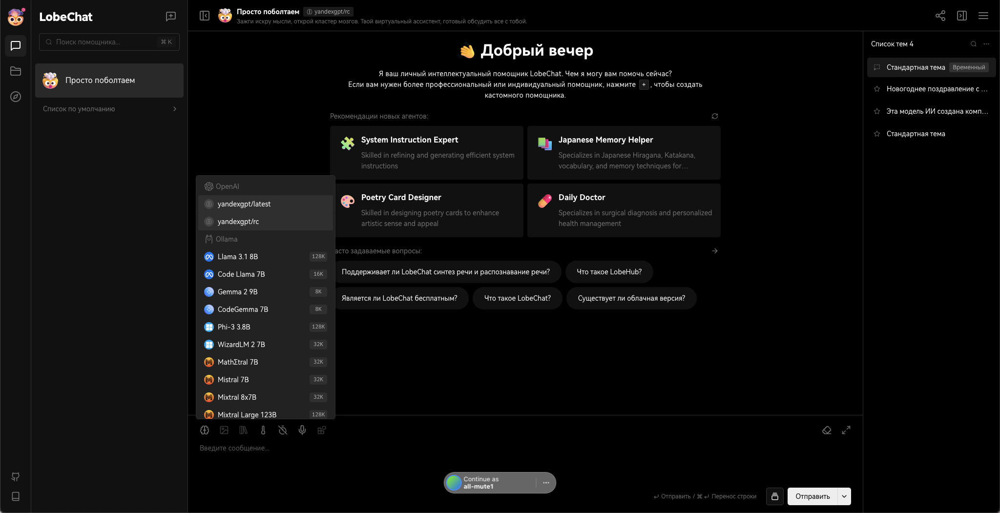
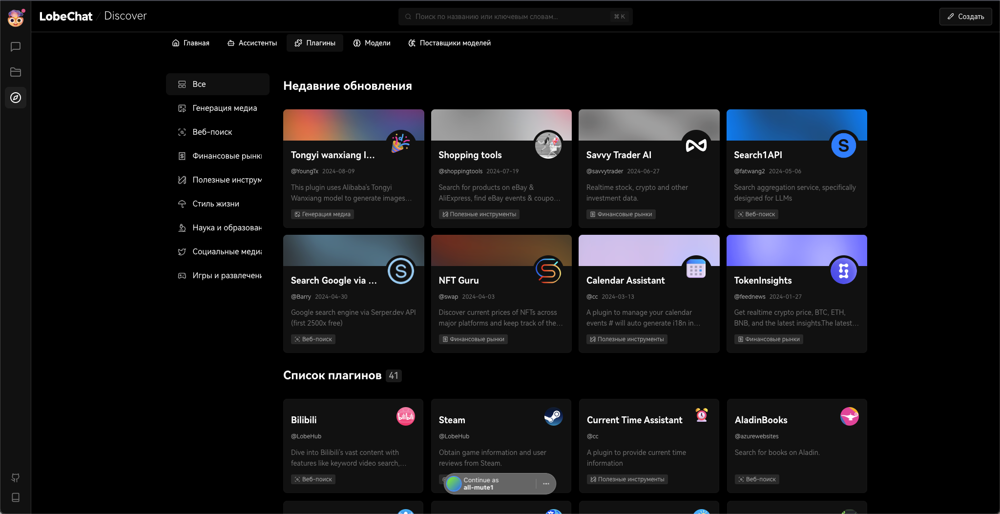
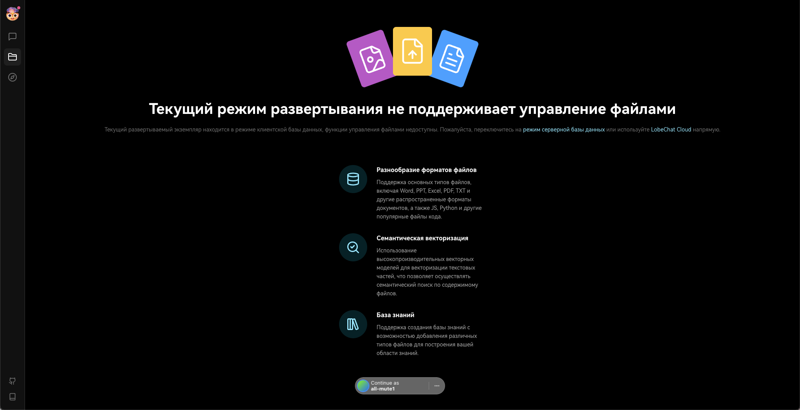

# LobeChat

LobeChat представляет собой современное приложение для общения с искусственным интеллектом, которое объединяет различные модели AI от таких поставщиков, как OpenAI, Claude и Gemini. Это мощный инструмент, предлагающий пользователям интуитивно понятный интерфейс, настраиваемые параметры и поддержку множества языков.

## Основные характеристики LobeChat

- **Многообразие моделей**: LobeChat поддерживает несколько моделей AI, что позволяет пользователям выбирать наиболее подходящие для их задач. Это включает в себя не только известные модели, но и возможность использования локальных моделей.

- **Плагин-система**: Платформа предлагает систему плагинов, что позволяет интегрировать сторонние сервисы и расширять функциональность чат-ботов. Пользователи могут добавлять плагины для поиска документов, генерации изображений и взаимодействия с различными платформами.

- **Кроссплатформенность**: LobeChat реализует технологию прогрессивного веб-приложения (PWA), что обеспечивает оптимизированный опыт как на настольных компьютерах, так и на мобильных устройствах.

- **Персонализация**: Пользователи могут настроить внешний вид приложения с помощью различных тем и цветовых схем, что делает взаимодействие более приятным и индивидуальным.

- **Аналитика и управление**: Платформа предоставляет инструменты для анализа работы чат-ботов и управления ими через простой веб-интерфейс. Это позволяет отслеживать эффективность взаимодействий и вносить необходимые изменения.