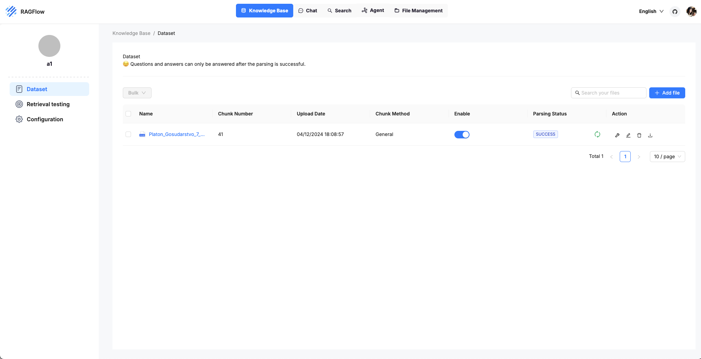
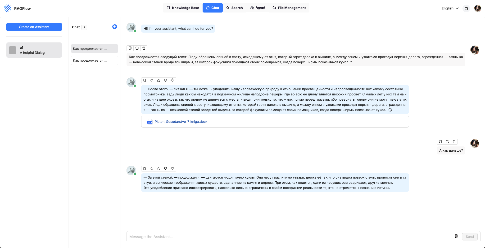
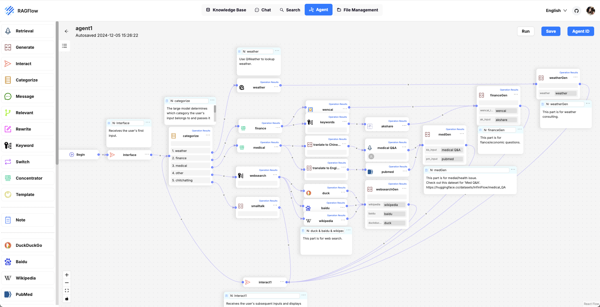

RAGFlow — это открытый движок RAG (Retrieval-Augmented Generation), который предназначен для глубокого понимания документов и извлечения знаний из неструктурированных данных. Этот инструмент позволяет компаниям интегрировать искусственный интеллект в свои процессы, улучшая качество обработки информации и взаимодействия с данными.

Основные характеристики RAGFlow
- Глубокое понимание документов: RAGFlow использует продвинутые методы для извлечения знаний из сложных форматов данных, что обеспечивает высокое качество результатов14
- Шаблонная фрагментация: Пользователи могут выбирать из различных шаблонов для гибкой и настраиваемой сегментации данных, что упрощает процесс извлечения информации24
- Снижение уровня галлюцинаций: Инструмент предоставляет обоснованные цитаты, что минимизирует вероятность генерации неверной информации и обеспечивает надежность выводов24
- Совместимость с различными форматами данных: RAGFlow поддерживает множество форматов, включая документы Word, Excel, изображения и веб-страницы, что делает его универсальным инструментом для работы с данными34
