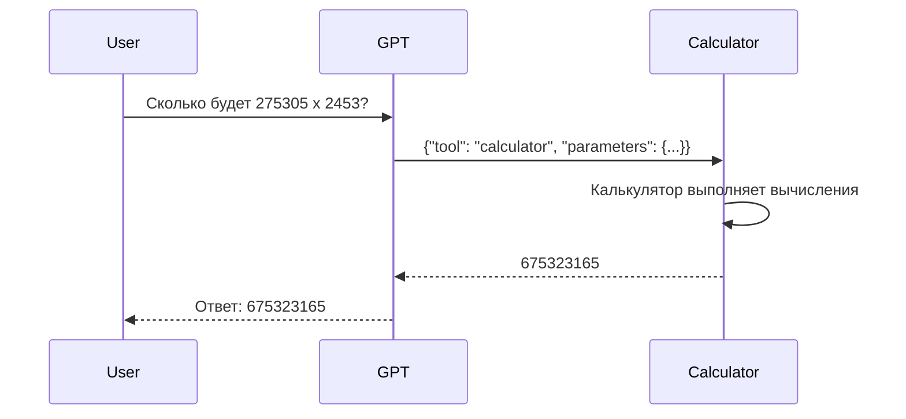
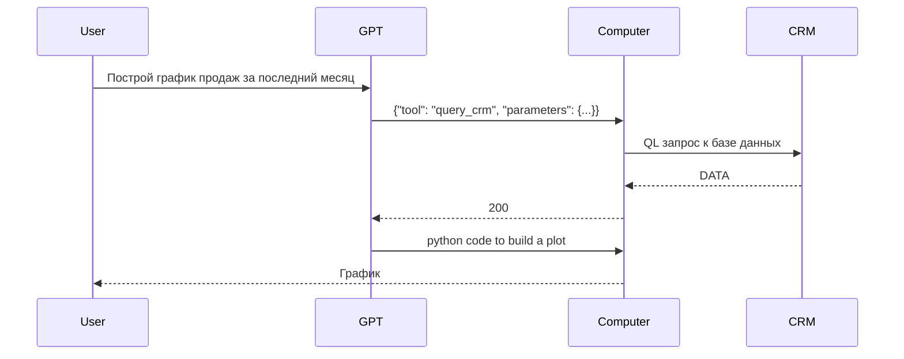
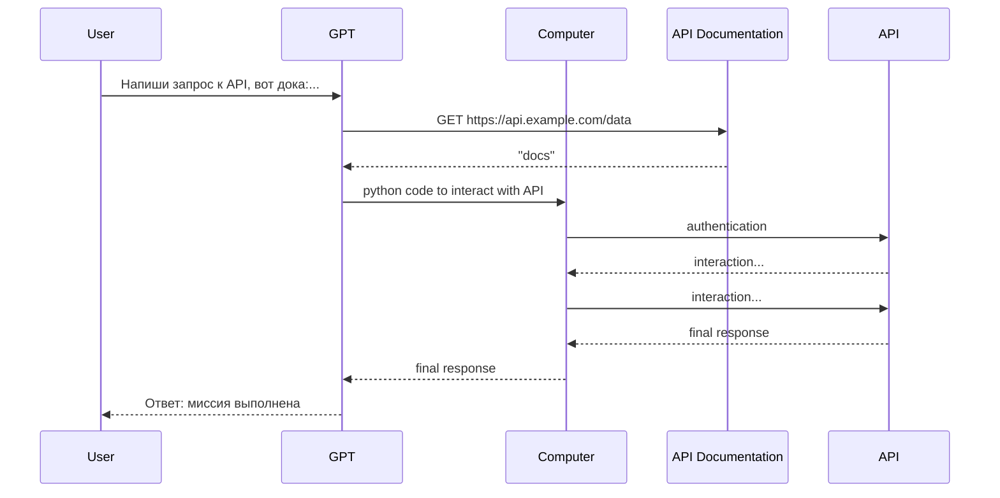
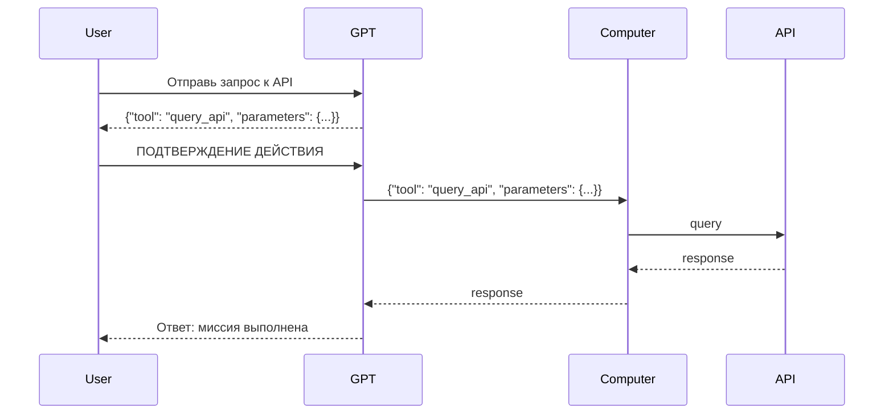

import Tabs from '@theme/Tabs';
import TabItem from '@theme/TabItem';
export const Highlight = ({children, color}) => (
  <span
    style={{
      backgroundColor: color,
      borderRadius: '2px',
      color: '#fff',
      padding: '0.2rem',
    }}>
    {children}
  </span>
);

# Tool Calling с точки зрения бизнеса

## Ограничения LLM

Большие языковые модели способны понимать, анализировать, интерпретировать и созидать текст. Однако, ограничены:
* они не могут выполнять действия со строгой логикой <Highlight color="#800000">275305 x 2453 = ?</Highlight>
* они не обладают актуальными знаниями о мире <Highlight color="#800000">Какое сегодня число?</Highlight>
* они не могут выполнять действия, которые требуют специальных знаний <Highlight color="#800000">Точные координаты Египетской пирамиды?</Highlight>
* они не могут воздействовать на внешние системы <Highlight color="#800000">Включи чайник на кухне</Highlight>

Function Calling позволяет расширить возможности LLM, добавив в их арсенал специализированные инструменты, например:
* Выполнение строгой логики: калькулятор, интерпретация кода на виртуальной машине
* Получение актуальных знаний: календарь, выполнение поисковых запросов (в те же Google и Яндекс)
* Получение специальных знаний: Полученить данные из БД, написать сотруднику компании чтобы задать вопрос
* Воздействие на внешние системы: Отправка API запросов, управление устройствами, управление командой

## Форматирование ответа для вызова инструментов

Большинство AI приложений созданы, чтобы взаимодействовать напрямую с человеком. Ассистенты должны отвечать на естественном, понятном нам языке. Но как насчет случаев, когда мы хотим, чтобы модель взаимодействовала со строгими внешними системами, такие как API и базы данных? Такие системы чаще всего имеют свой собственный язык общения - отсюда и возникает необходимость в Tool Calling - потребность получать ответы модели в том формате, который требуют внешние системы.

Допустим, мы хотим создать AI-приложение, которое будет использовать калькулятор. Мы можем написать следущий промпт:

**Системный промпт**
```
Перепиши вопрос пользователя в виде числа, знака операции и второго числа, разделив их пробелами.
```
**Запрос пользователя**
```
Сколько будет 275305 x 2453 = ?
```
**Ответ модели**
```
275305 * 2453
```
Теперь мы могли бы отправить этот текст в калькулятор, который вернет нам 675323165. Отлично!

Однако, что, если мы не хотим, чтобы модель всегда "пользовалась" калькулятором? Что, если мы хотим, чтобы LLM сама принимала решения, когда и какой инструмент использовать?

<details>
  <summary>Пример неудачного запроса</summary>

  **Системный промпт**
    ```
    Перепиши вопрос пользователя в виде числа, знака операции и второго числа, разделив их пробелами.
    ```
    **Запрос пользователя**
    ```
    Кто сейчас император Японии?
    ```
    **Ответ модели**
    ```
    0 $?$ 1
    ```
</details>

Для решения этой проблемы модели натренированы специальным образом сообщать, когда им нужно использовать какой-то инструмент. 
В момент, когда это происходит, LLM не генерирует текст, а заполняет параметры полей вызова инструмента также, как мы заполняем поля Яндекс.Форм:
```json
{
  "tool": "calculator",
  "parameters": {
    "operation": "multiply",
    "operands": [275305, 2453]
  }
}
```

<Tabs>
<TabItem value="arch1" label="Калькулятор">

</TabItem>
<TabItem value="arch2" label="Использование Базы данных">

</TabItem>
<TabItem value="arch3" label="Использование API без кода">

</TabItem>
</Tabs>

[Как использовать tool calling с моделями Yandex Cloud](./FC_yc1.mdx)

## Безопасность работы с внешними системами: human-in-loop

Возвращение к человеку за подтверждением перед выполнением действий с инструментами значительно повышает безопасность взаимодействия с внешними системами. Этот подход, известный как "человек в цикле" (human-in-loop), помогает избежать ошибок и нежелательных последствий, которые могут возникнуть из-за неправильного понимания запроса или неверного выполнения команды.

Когда модель запрашивает подтверждение у пользователя перед выполнением важных действий, таких как отправка API-запросов или изменение данных в базе, это добавляет дополнительный уровень контроля **и ответственности**. Пользователь может оценить предложенное действие, внести изменения или отменить его, что снижает риски и делает использование автоматизированных инструментов более безопасным.


## Популярные инструменты

1. Сервисы поисковых движков (SERP), такие как SearchAPI
2. Севрисы удаленного исполнения кода
3. Работа с браузером (получение данных с веб-страниц, эмуляция поведения пользователя)
4. Работа с базами данных
5. Публичные API (Яндекс.Погода, GitHub, ArXiv)
6. Инструменты работы с базами знаний (например, Notion, Confluence, Google Drive)

## Больше применений Tool Calling в бизнесе

Впервые Function Calling был представлен 13 июня в 2023 году. За это время он нашел множество применений, вот одни из самых интересных кейсов применения:

### Бизнес
* Чтение сущностей из ERP, CRM для ответа на вопрос
* Редактирование, создание сущностей в ERP, CRM (например, создание заказа, отправка письма клиенту)
* Выполнение расчетов, построение графиков, создание отчетов
* Автономный, многошаговый поиск информации с использованием нескольких знаний (интернет, корпоративная БЗ, сотрудники компании)

### Программирование
* Управление компьютером через терминал: создание/удаление файлов, запуск скриптов и программ
* Отправка API запросов без написания кода, обладая только документацией сервиса
* Запуск Query Language запросов в базах данных, обладая только схемой баз

### Автоматизация: мета-менеджеры
* соблюдение дедлайнов в команде
* помощь сотрудникам в организации проектов
* помощь в детерминировании задач

### Клиентсвкий сервис
* Передача запросов клиентов в CRM
* Вызов специалиста для решения сложных задач
* Автоматизация отправки документов клиенту

