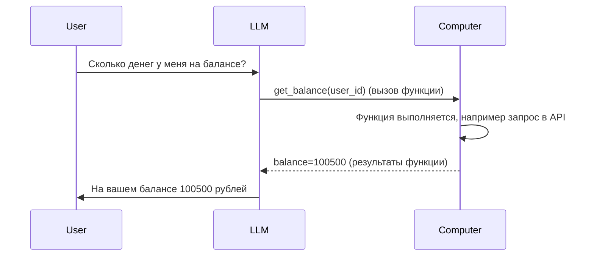

import Tabs from '@theme/Tabs';
import TabItem from '@theme/TabItem';
export const ColoredText = ({children, color}) => (
  <span style={{ color: color }}>
    {children}
  </span>
);

# Tool Calling @ Yandex Cloud with API, часть 1

[Tool Calling, мотивация с точки зрения бизнеса](./FC_why.mdx)<br />
[Интерактивные ноутбук и полезные утилиты](https://github.com/ai-cookbook/guides), использованные в руководстве.<br />
_Код покрыт тестами и поддерживается._

## Мотивация

Представим себе, что мы создаем бота-ассистента для онлайн-маркетплейсе, который будет ассистировать клиенту покупать товары.
Давайте отправим следущий запрос к YandexGPT:

```python
messages = []
messages.append({"role": "user", "text": "Сколько денег у меня на балансе?"})

response = chat_completion_request(messages)
messages.append(response['result']['alternatives'][0]['message'])

pretty_print_conversation(messages)
```
```bash
# user-highlight-line
user: Сколько денег у меня на балансе?

# assistant-highlight-line
assistant: К сожалению, я не могу ответить на этот вопрос, так как у меня нет доступа к информации о вашем банковском счёте или балансе. Чтобы узнать, сколько денег у вас на балансе, вам нужно проверить свой банковский счёт через мобильное приложение банка или официальный веб-сайт.
```

В идеале, мы хотим, чтобы бот-ассистент мог получить ответ на этот вопрос, самостоятельно обратившись к базе данных. Для подобного поведения нам потребуется использовать Tool Calling.

## Флоу работы Tool Calling



**Пример флоу работы чат-бота с использованием внешних инструментов:**

Параметры внутри тела запроса 1:
```python
"messages": [
  {role:system, text:""}, # Системный промпт
  {role:user, text:""}, # Сколько денег у меня на балансе?
],
"tools" [...] # Список инструментов, которые мы можем использовать
```
Ответ 1:
```python
"message": [
  {role:assistant, toolCallList:[...]}, # описание инструментов в виде json schema
]
```
**Если toolCallList есть в сообщении**, то нам нужно испольнить соответствующие функции, передав в них соответствующие аргументы. Например, для функции `def get_balance(user_id: str) -> str:` нам нужно передать аргумент `user_id`, который мы достанем из toolCallList.

Добавляем toolResultList:[...] дополнительным сообщением в историю.
Запрос 2:
```python
"messages": [
  {role:system, text:""},
  {role:user, text:""},
  {role:assistant, toolCallList:[...]},
  {role:assistant, toolResultList:[...]}, # результаты выполненных инструментов, с 'content': '100500'
],
"tools" [...] # Обязательно 1 в 1 тот же список инструментов, что и в запросе 1
```
Ассистент пишет ответ пользователю, основываясь на результатах инструментов.
Ответ 2:
```python
"message": [
  {role:assistant, text:""}, # ответ натуральным текстом, "На вашем балансе 100500 рублей"
]
```
Запрос 3 (дальнейшее общение) :
```python
"messages": [
  {role:system, text:""},
  {role:user, text:""},
  {role:assistant, toolCallList:[...]},
  {role:assistant, toolResultList:[...]},
  {role:assistant, text:""}, 
  {role:user, text:""}, # уточняющий вопрос пользователя
],
"tools" [...]
```

Учтите, что после запроса 2 мы также могли получить вызов инструмента - это был бы _последовательный_ вызов инструментов - что может быть очень полезно в некоторых сценариях.

**Системный промпт сильно влияет** на логику работы LLM в этом плане: 
* вы можете управлять последовательными, параллельными вызовами
* заставлять модель делать вызов инструмента постоянно или не делать вообще
* заставлять модель делать вызов только какого-то одного инструмента
* и следовать любой другой логике, с которой модель справится

### Как устроена JSON Schema

Внутри toolCallList для каждого инструмента мы должны сообщить модели, какие параметры ей нужно передать нам назад для корректного вызова инструмента. 

Общая структура JSON Schema выглядит следующим образом:
```python
# Пример JSON Schema для инструмента получения погоды из какого-то API
weather_tool = {
    "function": {
        "name": "weatherTool",
        "description": "Ходит в API и получает прогноз погоды в городе", # Старайтесь делать описание функции подробным
        "parameters": {
            "type": "object",
            "properties": {}, # Словарь параметров
            "required": [], # Список обязательных параметров
        }
    }
}
```

Внутри properties мы описываем параметры, которые нам нужны для вызова инструмента. Например:
```python
"properties": {
    "city": {
        "type": "string", # Тип параметра
        "description": "Название города, для которого нужно получить погоду." # Описание параметра
    },
    "units": {
        "type": "string",
        "enum": ["metric", "imperial"], # Список допустимых значений
        "default": "metric", # Значение по умолчанию
        "description": "Единицы измерения температуры. 'metric' для Цельсия, 'imperial' для Фаренгейта."
    },
    "days": {
        "type": "integer",
        "default": 1,
        "minimum": 1, # Выставление ограничений для параметров, подробнее по ссылке в конце
        "maximum": 5,
        "description": "Количество дней, для которых нужно получить погоду, начиная с текущего дня."
    }
    "regions": {
        "type": "array", # Массивы
        "default": ["center"],
        "maxItems": 3,
        "description": "Части города, для которых нужно получить погоду. Например: 'center', 'west', 'west-east' и т.д."
    },
}

"required": ["city"] # Список обязательных параметров, без которых функция не сможет отработать
```

<details>
  <summary>Что еще можно указать в JSON Schema</summary>

**1. Базовые типы данных**
```js
{
    "type": "string",    // строка
    "type": "number",    // число (включая дробные)
    "type": "integer",   // целое число
    "type": "boolean",   // логическое значение
    "type": "array",     // массив
    "type": "object",    // объект
    "type": "null"       // null
}
```

**2. Валидация строк**
```js
{
    "type": "string",
    "minLength": 2,          // минимальная длина
    "maxLength": 100,        // максимальная длина
    "pattern": "^[A-Za-z]+$", // регулярное выражение
    "format": "email"        // предопределенный формат
}
```

**3. Валидация чисел**
```js
{
    "type": "number",
    "minimum": 0,            // минимальное значение
    "maximum": 100,          // максимальное значение
    "exclusiveMinimum": 0,   // исключающий минимум
    "exclusiveMaximum": 100, // исключающий максимум
    "multipleOf": 5          // кратность числа
}
```

**4. Валидация массивов**
```js
{
    "type": "array",
    "items": {              // схема для элементов массива
        "type": "string"
    },
    "minItems": 1,         // минимальное количество элементов
    "maxItems": 10,        // максимальное количество элементов
    "uniqueItems": true    // все элементы должны быть уникальными
}
```

**5. Сложные объекты**
```js
{
    "type": "object",
    "properties": {
        "name": { 
            "type": "string" 
        },
        "age": { 
            "type": "integer" 
        }
    },
    "patternProperties": {           // свойства по регулярному выражению
        "^S_": { "type": "string" }
    },
    "additionalProperties": false,   // запрет дополнительных свойств
    "minProperties": 1,             // минимальное количество свойств
    "maxProperties": 10             // максимальное количество свойств
}
```

**6. Условная валидация**
```js
{
    "type": "object",
    "if": {
        "properties": { 
            "type": { "const": "user" } 
        }
    },
    "then": {
        "required": ["username"]
    },
    "else": {
        "required": ["adminCode"]
    }
}
```

**7. Комбинирование схем**
```js
{
    "anyOf": [                     // хотя бы одна схема должна подойти
        { "type": "string" },
        { "type": "number" }
    ],
    "allOf": [                     // все схемы должны подойти
        { "type": "object" },
        { "required": ["id"] }
    ],
    "oneOf": [                     // ровно одна схема должна подойти
        { "type": "string" },
        { "type": "null" }
    ],
    "not": {                       // схема не должна подойти
        "type": "string"
    }
}
```

**8. Встроенные форматы**
```js
{
    "type": "string",
    "format": "date-time",      // ISO 8601 дата/время
    // Другие встроенные форматы:
    // "date"                   // только дата
    // "time"                   // только время
    // "email"                  // email адрес
    // "ipv4"                   // IPv4 адрес
    // "ipv6"                   // IPv6 адрес
    // "uri"                    // URI
    // "uuid"                   // UUID
    // "hostname"               // имя хоста
    // "json-pointer"           // JSON указатель
}
```

**9. Составные типы**
```js
{
    "type": ["string", "null"],  // поле может быть строкой или null
    "properties": {
        "status": {
            "type": ["string", "integer"],
            "enum": ["active", "inactive", 0, 1]
        }
    }
}
```
</details>

<details>
  <summary>Пример JSON Schema для выполнения любого HTTP-запроса</summary>

```python
{
    "name": "make_http_request",
    "description": "Выполняет HTTP-запрос к указанному URL с заданными параметрами",
    "parameters": {
        "type": "object",
        "properties": {
            "method": {
                "type": "string",
                "description": "HTTP метод запроса",
                "enum": ["GET", "POST", "PUT", "DELETE", "PATCH", "HEAD", "OPTIONS"],
                "default": "GET"
            },
            "url": {
                "type": "string",
                "description": "URL для выполнения запроса",
                "format": "uri"
            },
            "query_params": {
                "type": "object",
                "description": "Query параметры для URL",
                "additionalProperties": {
                    "type": ["string", "number", "boolean", "array"],
                    "items": {
                        "type": ["string", "number", "boolean"]
                    }
                }
            },
            "headers": {
                "type": "object",
                "description": "HTTP заголовки запроса",
                "patternProperties": {
                    "^[A-Za-z0-9-]+$": {
                        "type": "string"
                    }
                }
            },
            "data": {
                "type": "object",
                "description": "Тело запроса для POST/PUT/PATCH методов",
                "additionalProperties": true
            },
            "timeout": {
                "type": "number",
                "description": "Таймаут запроса в секундах",
                "minimum": 0,
                "maximum": 300,
                "default": 30
            },
            "verify_ssl": {
                "type": "boolean",
                "description": "Проверять SSL сертификат",
                "default": true
            },
            "auth": {
                "type": "object",
                "description": "Параметры аутентификации",
                "properties": {
                    "type": {
                        "type": "string",
                        "enum": ["basic", "bearer", "digest", "none"],
                        "default": "none"
                    },
                    "username": {
                        "type": "string"
                    },
                    "password": {
                        "type": "string"
                    },
                    "token": {
                        "type": "string"
                    }
                },
                "dependencies": {
                    "username": ["password"],
                    "password": ["username"]
                }
            },
            "retry": {
                "type": "object",
                "description": "Настройки повторных попыток",
                "properties": {
                    "max_attempts": {
                        "type": "integer",
                        "minimum": 0,
                        "maximum": 5,
                        "default": 0
                    },
                    "delay": {
                        "type": "number",
                        "minimum": 0,
                        "default": 1
                    }
                }
            }
        },
        "required": ["url"],
        "additionalProperties": false
    }
}
```

Пример простого GET-запроса:
```python
{
    "method": "GET",
    "url": "https://api.example.com/users",
    "query_params": {
        "page": 1,
        "limit": 10
    }
}
```

POST-запрос с аутентификацией:
```python
{
    "method": "POST",
    "url": "https://api.example.com/data",
    "headers": {
        "Content-Type": "application/json",
        "X-API-Version": "1.0"
    },
    "data": {
        "name": "Test User",
        "email": "test@example.com"
    },
    "auth": {
        "type": "bearer",
        "token": "your-token-here"
    }
}
```
</details>

[Максимально подробное руководство по JSON Schema](https://json-schema.org/learn/getting-started-step-by-step)

