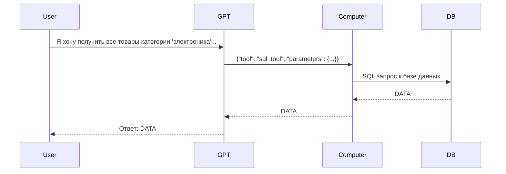
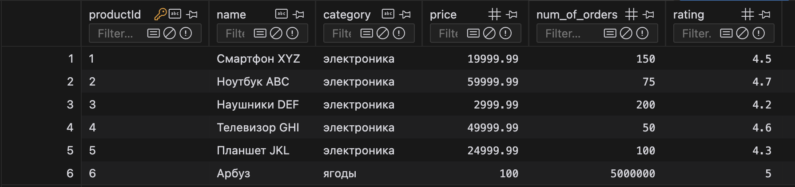

import Tabs from '@theme/Tabs';
import TabItem from '@theme/TabItem';


# Tool Calling @ Yandex Cloud with API, часть 2

[Tool Calling, мотивация с точки зрения бизнеса](./FC_why.mdx)<br />
[Интерактивные ноутбук и полезные утилиты](https://github.com/ai-cookbook/guides), использованные в руководстве.<br />
_Код покрыт тестами и поддерживается._

## Создаем ассистента для онлайн-маркетплейса

Продолжаем разработку нашего бота-ассистента, который будет помогать пользователю на онлайн-маркетплейсе. Пайплайн, по которому мы хотим пройти, как пользователь:
1. Получить баланс пользователя
2. Получить список товаров, которые мы можем купить, укладываясь в бюджет
3. Оформить заказ

Давайте создадим несколько инструментов, которые нам пригодятся для нашего бота-ассистента.
- **balance_tool** - инструмент для получения баланса пользователя по его userId
- **product_list_tool** - инструмент для получения списка товаров с фильтрациями и сортировками
- **order_tool** - инструмент для создания заказа по productId

<Tabs>
<TabItem value="balance_tool">
```python
balance_tool = {
        "function": {
            "name": "BalanceTool",
            "description": "Получает баланс пользователя в рублях из базы данных.",
            "parameters": {
                "type": "object",
                "properties": {
                    "userId": {
                        "type": "string",
                        "description": "Идентификатор пользователя, для которого нужно получить баланс."
                    }
                },
                "required": ["userId"],
                "additionalProperties": False
            }
        }
    }
```
</TabItem>
<TabItem value="product_list_tool">
```python
product_list_tool = {
            "function": {
                "name": "ProductListTool",
                "description": "Получает список товаров из базы данных на основе заданных параметров. Позволяет фильтровать товары по диапазону цен, категории и критерию сортировки.",
                "parameters": {
                    "type": "object",
                    "properties": {
                        "priceMinMax": {
                            "type": "array",
                            "items": {
                                "type": "number"
                            },
                            "description": "Диапазон цен в формате [минимальная цена, максимальная цена]. Позволяет пользователю указать, какие товары его интересуют в пределах заданного ценового диапазона."
                        },
                        "category": {
                            "type": "string",
                            "description": "Категория товаров, по которой будет осуществляться фильтрация. Например, 'электроника', 'одежда', 'книги', 'дом и сад'. Это позволяет пользователю сузить поиск до определенной группы товаров."
                        },
                        "sortBy": {
                            "type": "string",
                            "enum": ["price", "popularity", "rating"],
                            "description": "Критерий сортировки товаров. Возможные значения: 'price' для сортировки по цене, 'popularity' для сортировки по популярности, 'rating' для сортировки по рейтингу. Это позволяет пользователю получить список товаров в удобном для него порядке."
                        }
                    },
                    "required": ["priceMinMax", "category"],
                    "additionalProperties": False
                }
            }
        }
```
</TabItem>
<TabItem value="order_tool">
```python
order_tool = {
        "function": {
            "name": "OrderTool",
            "description": "инструмент, который заказывает товар по его идентификатору productId",
            "parameters": {
                "type": "object",
                "properties": {
                    "productId": {
                        "type": "string",
                        "description": "Идентификатор товара, который нужно заказать."
                    },
                    "quantity": {
                        "type": "integer",
                        "description": "Количество товара для заказа.",
                        "default": 1,
                        "minimum": 1
                    }
                },
                "required": ["productId", "quantity"],
                "additionalProperties": False
            }
        }
    }
```
</TabItem>
</Tabs>

:::info[Далее в коде я буду использовать функции:]
- `chat_completion_request(messages, tools=None) -> YandexGPTResponse` - функция для отправки запроса к YandexGPT
- `get_function_call_from_response(response) -> toolCalls` - функция для получения объекта toolCalls из ответа YandexGPT
- `process_functions(toolCalls) -> toolResult` - функция, которая распознает, какую питон-функцию вызвать, и запускает ее, передавая ей аргументы от LLM

<details>
  <summary>Подробнее про process_functions</summary>

```python
def process_functions(toolCalls: List[Dict[str, Any]]) -> List[Dict[str, Any]]:
    """Обрабатывает список вызовов инструментов и возвращает результаты."""
    tools_map = {
        "ProductListTool": process_tool_product_list_tool,
        "BalanceTool": process_tool_balance_tool,
        "OrderTool": process_tool_order_tool,
        "ask_database": process_tool_sql_tool,
        "searchapi": process_tool_searchapi,
        "serverless_func": process_tool_serverless_func
    }
    
    results = []
    for tool_call in toolCalls:
        name = tool_call['functionCall']['name']
        arguments = tool_call['functionCall'].get('arguments', {})
        if name in tools_map:
            # Вызываем функцию с переданными аргументами
            result = tools_map[name](**arguments)
            results.append(pack_function_result(name, result))
    
    return results

def process_tool_product_list_tool(category: str, priceMinMax: List[int], sortBy: str = 'price') -> List[Dict[str, Any]]:
    """Обрабатывает запрос на получение списка продуктов."""
    # Здесь можно добавить логику для получения реальных данных
    return [
        {'productId': 'siaomi453', 'name': 'сяоми 4+ pro', 'category': category, 'price': 10_000},
        {'productId': 'iphone15', 'name': 'iphone 15', 'category': category, 'price': 280_000}
    ]

def process_tool_balance_tool(userId: str) -> Dict[str, Any]:
    """Обрабатывает запрос на получение баланса пользователя."""
    # Здесь можно добавить логику для получения реального баланса
    return {'userId': userId, 'balance': 10000}

def process_tool_order_tool(productId: str, quantity: int) -> Dict[str, Any]:
    """Обрабатывает запрос на создание заказа."""
    # Здесь можно добавить логику для обработки заказа
    return {'orderId': 'order123', 'productId': productId, 'quantity': quantity}

def process_tool_sql_tool(query: str) -> List[tuple]:
    """Обрабатывает SQL-запрос и возвращает результаты."""
    conn = None
    try:
        conn = sqlite3.connect(db_path)
        cursor = conn.cursor()
        cursor.execute(query)
        result = cursor.fetchall()
        return result
    except sqlite3.Error as e:
        print(f"Ошибка при выполнении SQL-запроса: {e}")
        return []
    finally:
        if conn:
            conn.close()

def process_tool_searchapi(query: str) -> str:
    """Обрабатывает запрос к поисковому API."""
    return search_api_generative(query)

def process_tool_serverless_func(name: str) -> str:
    """Обрабатывает вызов серверной функции."""
    return send_post_request(name)
```
</details>

:::

---

### Простой вызов функции

**Давайте начнем с простого: получим баланс пользователя.**<br />


```python
session_info = "\n\nИнформация о сессии:\nТекущее время: 12:11. Текущий userId пользователя: wg359g3f39"

messages = []
messages.append({"role": "system", "text": f"Ты - полезный бот, который помогает пользователю с его проблемами. Ты можешь использовать инструменты, чтобы получить актуальную информацию. Но пользоваться ими нужно не всегда. {session_info}"})
messages.append({"role": "user", "text": "Сколько у меня денег на балансе?"})

# highlight-next-line
response = chat_completion_request(messages, tools=[balance_tool])

toolCalls: list = get_function_call_from_response(response)
messages.append({
    'role': 'assistant',
    'toolCallList': {'toolCalls': toolCalls}
})

pretty_print_conversation(messages)
```
```bash
# system-highlight-start
system: Ты - полезный бот, который помогает пользователю с его проблемами. Ты можешь использовать инструменты, чтобы получить актуальную информацию. Но пользоваться ими нужно не всегда. 
Информация о сессии:
Текущее время: 12:11. Текущий userId пользователя: wg359g3f39
# system-highlight-end

# user-highlight-line
user: Сколько у меня денег на балансе?

# assistant-func-highlight-line
assistant: {'toolCalls': [{'functionCall': {'name': 'BalanceTool', 'arguments': {'userId': 'wg359g3f39'}}}]}
```

Выполним функцию, и вернем результат обратно gpt. Используем заранее подготовленную функцию `process_functions`, внутри которой вызовется функция `process_tool_balance_tool` с аргументом `userId`
```python
# highlight-next-line
toolResults: list = process_functions(toolCalls)
messages.append({
    'role': 'assistant',
    'toolResultList': {'toolResults': toolResults}
})

# highlight-next-line
response = chat_completion_request(messages, tools=[balance_tool])
messages.append(response['result']['alternatives'][0]['message'])
pretty_print_conversation(messages)
```
```bash
# system-highlight-start
system: Ты - полезный бот, который помогает пользователю с его проблемами. Ты можешь использовать инструменты, чтобы получить актуальную информацию. Но пользоваться ими нужно не всегда. 
Информация о сессии:
Текущее время: 12:11. Текущий userId пользователя: wg359g3f39
# system-highlight-end

# user-highlight-line
user: Сколько у меня денег на балансе?

# assistant-func-highlight-line
assistant: {'toolCalls': [{'functionCall': {'name': 'BalanceTool', 'arguments': {'userId': 'wg359g3f39'}}}]}

# assistant-func-highlight-line
assistant: {'toolResults': [{'functionResult': {'name': 'BalanceTool', 'content': "{'userId': 'wg359g3f39', 'balance': 10000}"}}]}

# assistant-highlight-line
assistant: На вашем балансе 10000 рублей.
```

Как можно видеть, LLM прочитала то, что мы отправили ей в toolResults, и вывела результат на человеческом языке.

### Параллельный вызов нескольких функций

Теперь давайте попробуем за 1 цикл tool calling_a получить список товаров, которые нам по карману:

User prompt:
`...которые я могу себе позволить купить с учетом моего баланса. Показывай только те товары, которые я могу себе позволить купить.`

Для этого нам одновременно нужно передать в LLM и ассортимент, и наш баланс.

```python
session_info = "\n\nИнформация о сессии:\nТекущее время: 12:11. Текущий userId пользователя: wg359g3f39"
# highlight-next-line
tools = [product_list_tool, balance_tool, order_tool]

messages = []
messages.append({"role": "system", "text": f"Ты - полезный бот, который помогает пользователю с его проблемами. Ты можешь использовать инструменты, чтобы получить актуальную информацию. Но пользоваться ими нужно не всегда. Если пользователь ищет товары, то всегда параллельно с вызовом инструмента ProductListTool вызывай и BalanceTool. {session_info}"})
messages.append({"role": "user", "text": "Покажи мне товары категории 'электроника' в диапазоне цен от 1000 до 50000 рублей, отсортированные по популярности, которые я могу себе позволить купить с учетом моего баланса. Показывай только те товары, которые я могу себе позволить купить."})

# highlight-next-line
response = chat_completion_request(messages, tools=tools)

toolCalls: list = get_function_call_from_response(response)
messages.append({
    'role': 'assistant',
    'toolCallList': {'toolCalls': toolCalls}
})

pretty_print_conversation(messages)
```
```bash
# system-highlight-start
system: Ты - полезный бот, который помогает пользователю с его проблемами. Ты можешь использовать инструменты, чтобы получить актуальную информацию. Но пользоваться ими нужно не всегда. Если пользователь ищет товары, то всегда параллельно с вызовом инструмента ProductListTool вызывай и BalanceTool. 
Информация о сессии:
Текущее время: 12:11. Текущий userId пользователя: wg359g3f39
# system-highlight-end

# user-highlight-line
user: Покажи мне товары категории 'электроника' в диапазоне цен от 1000 до 50000 рублей, отсортированные по популярности, которые я могу себе позволить купить с учетом моего баланса. Показывай только те товары, которые я могу себе позволить купить.

# assistant-func-highlight-line
assistant: {'toolCalls': [{'functionCall': {'name': 'ProductListTool', 'arguments': {'category': 'электроника', 'priceMinMax': [1000, 50000], 'sortBy': 'popularity'}}}, {'functionCall': {'name': 'BalanceTool', 'arguments': {'userId': 'wg359g3f39'}}}]}
```

LLM вызвал оба инструмента параллельно. Давайте передадим оба вызова в `process_functions`, которая выполнит оба инструмента и вернет результаты. После этого оба результата пошлем в LLM.
```python
# highlight-next-line
toolResults: list = process_functions(toolCalls)
messages.append({
    'role': 'assistant',
    'toolResultList': {'toolResults': toolResults}
})

# highlight-next-line
response = chat_completion_request(messages, tools=tools)
messages.append(response['result']['alternatives'][0]['message'])
pretty_print_conversation(messages)
```
```bash
# system-highlight-start
system: Ты - полезный бот, который помогает пользователю с его проблемами. Ты можешь использовать инструменты, чтобы получить актуальную информацию. Но пользоваться ими нужно не всегда. Если пользователь ищет товары, то всегда параллельно с вызовом инструмента ProductListTool вызывай и BalanceTool. 
Информация о сессии:
Текущее время: 12:11. Текущий userId пользователя: wg359g3f39
# system-highlight-end

# user-highlight-line
user: Покажи мне товары категории 'электроника' в диапазоне цен от 1000 до 50000 рублей, отсортированные по популярности, которые я могу себе позволить купить с учетом моего баланса. Показывай только те товары, которые я могу себе позволить купить.

# assistant-func-highlight-line
assistant: {'toolCalls': [{'functionCall': {'name': 'ProductListTool', 'arguments': {'category': 'электроника', 'priceMinMax': [1000, 50000], 'sortBy': 'popularity'}}}, {'functionCall': {'name': 'BalanceTool', 'arguments': {'userId': 'wg359g3f39'}}}]}

# assistant-func-highlight-line
assistant: {'toolResults': [{'functionResult': {'name': 'ProductListTool', 'content': "[{'productId': 'siaomi453', 'name': 'сяоми 4+ pro', 'category': 'электроника', 'price': 10000}, {'productId': 'iphone15', 'name': 'iphone 15', 'category': 'электроника', 'price': 280000}]"}}, {'functionResult': {'name': 'BalanceTool', 'content': "{'userId': 'wg359g3f39', 'balance': 10000}"}}]}

# assistant-highlight-start
assistant: Вы можете себе позволить купить следующие товары:

1. **Сяоми 4+ pro**
   - **Категория:** Электроника
   - **Цена:** 10000 рублей

Ваш баланс составляет 10000 рублей, что позволяет вам приобрести данный товар.
# assistant-highlight-end
```

### Оформление заказа

Теперь закончим наш диалог, приобретя товар.

```python
# highlight-next-line
messages.append({"role": "user", "text": 'Как пелось у RX4D в "запрети мне носить сяоми", это лучший микрокомпьютер, топ за свои деньги. Оформи заказ на сяоми 4+'})

response = chat_completion_request(messages, tools=tools)

toolCalls: list = get_function_call_from_response(response)
messages.append({
    'role': 'assistant',
    'toolCallList': {'toolCalls': toolCalls}
})

# highlight-next-line
toolResults: list = process_functions(toolCalls)
messages.append({
    'role': 'assistant',
    'toolResultList': {'toolResults': toolResults}
})

response = chat_completion_request(messages, tools=tools)
messages.append(response['result']['alternatives'][0]['message'])
pretty_print_conversation(messages)
```
```bash
# system-highlight-start
system: Ты - полезный бот, который помогает пользователю с его проблемами. Ты можешь использовать инструменты, чтобы получить актуальную информацию. Но пользоваться ими нужно не всегда. Если пользователь ищет товары, то всегда параллельно с вызовом инструмента ProductListTool вызывай и BalanceTool. 
Информация о сессии:
Текущее время: 12:11. Текущий userId пользователя: wg359g3f39
# system-highlight-end

# user-highlight-line
user: Покажи мне товары категории 'электроника' в диапазоне цен от 1000 до 50000 рублей, отсортированные по популярности, которые я могу себе позволить купить с учетом моего баланса. Показывай только те товары, которые я могу себе позволить купить.

# assistant-func-highlight-line
assistant: {'toolCalls': [{'functionCall': {'name': 'ProductListTool', 'arguments': {'category': 'электроника', 'priceMinMax': [1000, 50000], 'sortBy': 'popularity'}}}, {'functionCall': {'name': 'BalanceTool', 'arguments': {'userId': 'wg359g3f39'}}}]}

# assistant-func-highlight-line
assistant: {'toolResults': [{'functionResult': {'name': 'ProductListTool', 'content': "[{'productId': 'siaomi453', 'name': 'сяоми 4+ pro', 'category': 'электроника', 'price': 10000}, {'productId': 'iphone15', 'name': 'iphone 15', 'category': 'электроника', 'price': 280000}]"}}, {'functionResult': {'name': 'BalanceTool', 'content': "{'userId': 'wg359g3f39', 'balance': 10000}"}}]}

# assistant-highlight-start
assistant: Вы можете себе позволить купить следующие товары:

1. **Сяоми 4+ pro**
   - **Категория:** Электроника
   - **Цена:** 10000 рублей

Ваш баланс составляет 10000 рублей, что позволяет вам приобрести данный товар.
# assistant-highlight-end

# user-highlight-line
user: Как пелось у RX4D в "запрети мне носить сяоми", это лучший микрокомпьютер, топ за свои деньги. Оформи заказ на сяоми 4+

# assistant-func-highlight-line
assistant: {'toolCalls': [{'functionCall': {'name': 'OrderTool', 'arguments': {'productId': 'siaomi453', 'quantity': 1}}}]}

# assistant-func-highlight-line
assistant: {'toolResults': [{'functionResult': {'name': 'OrderTool', 'content': "{'orderId': 'order123', 'productId': 'Сяоми 4+ pro', 'quantity': 1}"}}]}

# assistant-highlight-line
assistant: Ваш заказ на микрокомпьютер Сяоми 4+ успешно оформлен. Идентификатор заказа: order123.
```

Поздравляю! Ваш заказ на микрокомпьютер Сяоми 4+ успешно оформлен.

## Вызов функции с нестрогими параметрами
<Tabs>
<TabItem value="arch1" label="Архитектура">

</TabItem>
<TabItem value="example1" label="База данных">

</TabItem>
<TabItem value="tool_code" label="process_sql_tool">
```python
def process_tool_sql_tool(query: str) -> List[tuple]:
    """Обрабатывает SQL-запрос и возвращает результаты."""
    conn = None
    try:
        conn = sqlite3.connect(db_path)
        cursor = conn.cursor()
        # highlight-next-line
        cursor.execute(query)
        result = cursor.fetchall()
        return result
    except sqlite3.Error as e:
        print(f"Ошибка при выполнении SQL-запроса: {e}")
        return []
    finally:
        if conn:
            conn.close()
```
</TabItem>
</Tabs>

Теперь попробуем реализовать приложение Chat-with-Data. Я заранее подготовил sqlite базу данных с таблицей `products`, в которой хранятся данные о товарах. Я хочу получить `все товары категории 'электроника', отсортированные по рейтингу, ценой меньше 30к`.

```python
products_table_description = """
Таблица "products" предназначена для хранения информации о товарах, доступных в магазине. 
Каждый товар имеет следующие поля:
- productId: уникальный идентификатор товара (TEXT, PRIMARY KEY)
- name: название товара (TEXT, NOT NULL)
- category: категория товара (TEXT, NOT NULL). Например: электроника, одежда, книги, дом, ягоды, сад
- price: цена товара (REAL, NOT NULL)
- num_of_orders: количество заказов данного товара (INTEGER, NOT NULL)
- rating: рейтинг товара (REAL, NOT NULL)
"""

sql_tool = {
        "function": {
            "name": "ask_database",
            "description": f"Use this function to answer user questions about the database. Input should be a fully formed SQL query.",
            "parameters": {
                "type": "object",
                "properties": {
                    "query": {
                        "type": "string",
                        "description": f"""
                                SQL query extracting info to answer the user's question.
                                SQL should be written using this database schema:
                                {products_table_description}
                                The query should be returned in plain text, not in JSON.
                                """,
                    }
                },
                "required": ["query"],
            },
        }
    }
```
```python
session_info = "\n\nИнформация о сессии:\nТекущее время: 12:11. Текущий userId пользователя: wg359g3f39"
# highlight-next-line
tools = [sql_tool, balance_tool, order_tool]

messages = []
messages.append({"role": "system", "text": f"Ты - полезный бот, который помогает пользователю с его проблемами. Ты можешь использовать инструменты, чтобы получить актуальную информацию. Но пользоваться ими нужно не всегда. {session_info}"})
# highlight-next-line
messages.append({"role": "user", "text": "Мне нужны все товары категории 'электроника', отсортированные по рейтингу, ценой меньше 30к."})

response = chat_completion_request(messages, tools=tools)

toolCalls: list = get_function_call_from_response(response)
messages.append({
    'role': 'assistant',
    'toolCallList': {'toolCalls': toolCalls}
})

# highlight-next-line
toolResults: list = process_functions(toolCalls) # внутри функции выполняется запрос к базе данных, написанный GPT
messages.append({
    'role': 'assistant',
    'toolResultList': {'toolResults': toolResults}
})

response = chat_completion_request(messages, tools=tools)
messages.append(response['result']['alternatives'][0]['message'])
with open('output.md', 'w', encoding='utf-8') as f:
        assistant_message = response['result']['alternatives'][0]['message']['text']
        f.write(assistant_message)

pretty_print_conversation(messages)
```
```bash
# system-highlight-start
system: Ты - полезный бот, который помогает пользователю с его проблемами. Ты можешь использовать инструменты, чтобы получить актуальную информацию. Но пользоваться ими нужно не всегда. 
Информация о сессии:
Текущее время: 12:11. Текущий userId пользователя: wg359g3f39
# system-highlight-end

# user-highlight-line
user: Мне нужны все товары категории 'электроника', отсортированные по рейтингу, ценой меньше 30к.

# assistant-func-highlight-line
assistant: {'toolCalls': [{'functionCall': {'name': 'ask_database', 'arguments': {'query': "SELECT * FROM products WHERE category = 'электроника' AND price < 30000 ORDER BY rating DESC"}}}]}

# assistant-func-highlight-line
assistant: {'toolResults': [{'functionResult': {'name': 'ask_database', 'content': "[('1', 'Смартфон XYZ', 'электроника', 19999.99, 150, 4.5), ('5', 'Планшет JKL', 'электроника', 24999.99, 100, 4.3), ('3', 'Наушники DEF', 'электроника', 2999.99, 200, 4.2)]"}}]}

# assistant-highlight-start
assistant: Вот список всех товаров категории 'электроника', отсортированных по рейтингу, ценой меньше 30к:

1. Смартфон XYZ
   - Название: Смартфон XYZ
   - Категория: электроника
   - Цена: 19999.99 рублей
   - Количество заказов: 150
   - Рейтинг: 4.5

2. Планшет JKL
   - Название: Планшет JKL
   - Категория: электроника
   - Цена: 24999.99 рублей
   - Количество заказов: 100
   - Рейтинг: 4.3

3. Наушники DEF
   - Название: Наушники DEF
   - Категория: электроника
   - Цена: 2999.99 рублей
   - Количество заказов: 200
   - Рейтинг: 4.2
# assistant-highlight-end
```

Одним из преимуществ того подхода является тот факт, что мы можем не передавать данные пользователей в LLM ни в каком виде, при этом всё равно решая задачу.

## Дополнительно

### Вызов Yandex Cloud Serverless Functions

Yandex Cloud Serverless Functions — это гибкая платформа, на которой можно запускать исполнение (py, js, go, etc.) функций без постоянного хостинга сервера. Для демонстрации интеграции я подготовил простенькую питон-функцию, которая принимает на вход только один параметр — name, и возвращает отформатированную строку с приветствием.

<details>
<summary>send_post_request & index.py</summary>

Функция в на моём компьютере:
```python
def send_post_request(name):
    url = f"https://functions.yandexcloud.net/d4ekuoccv9lmm79dh5rr?name={name}"
    with httpx.Client() as client:
        response = client.get(url)

        return response.text
```

Функция в Yandex Cloud:
```python
def handler(event, context):
    name = event['queryStringParameters']['name']

    return {
        'statusCode': 200,
        'headers': {
            'Content-Type': 'text/plain'
        },
        'isBase64Encoded': False,
        # highlight-next-line
        'body': 'Hello to {} from serverless func!'.format(name)
    }
```

</details>

Давайте попросим GPT отправить к ней запрос.

```python
serverless_func_tool = {
        "function": {
            "name": "serverless_func",
            "description": "Запускает функцию на Yandex Cloud Serverless Functions",
            "parameters": {
                "type": "object",
                "properties": {
                    "name": {
                        "type": "string",
                        "description": "Имя пользователя"
                    }
                },
                "required": ["name"],
            },
        }
    }

tools = [serverless_func_tool]

messages = []
messages.append({"role": "user", "text": "Запусти функцию в yandex cloud, передай имя 'David'"})

# ... тот же код, что и в предыдущем примере
```

```bash
# user-highlight-line
user: Запусти функцию в yandex cloud, передай имя 'David'

# assistant-func-highlight-line
assistant: {'toolCalls': [{'functionCall': {'name': 'serverless_func', 'arguments': {'name': 'David'}}}]}

# assistant-func-highlight-line
assistant: {'toolResults': [{'functionResult': {'name': 'serverless_func', 'content': 'Hello to David from serverless func!'}}]}
```

### Использование Search API (Нейро поиск) в качестве инструмента

[Код функции для отправки запроса в Нейро](https://github.com/ai-cookbook/guides/blob/main/yc/function_calling_api/cloud_instruments/searchapi.py)

```python
searchapi_tool = {
        "function": {
            "name": "searchapi",
            "description": "Отправляет запрос в поисковый движок по интернету Нейро и получает ответ",
            "parameters": {
                "type": "object",
                "properties": {
                    "query": {
                        "type": "string",
                        "description": "Запрос для поиска в интернете"
                    }
                },
                "required": ["query"],
            },
        }
    }

tools = [searchapi_tool]

messages = []
messages.append({"role": "system", "text": f"Ты - полезный бот, который помогает пользователю с его проблемами. Старайся по возможности использовать инструмент searchapi, чтобы получить информацию из интернета."})
messages.append({"role": "user", "text": "Погода в Москве"}) # если сделать запрос на "Свежие новости за сегодня", то скорее всего YandexGPT не сможет ответить, так как новости будут содержать острополитические темы, из-за которых запрос улетит в этику

# ... тот же код, что и в предыдущем примере
```
```bash
# system-highlight-start
system: Ты - полезный бот, который помогает пользователю с его проблемами. Старайся по возможности использовать инструмент searchapi, чтобы получить информацию из интернета.
# system-highlight-end

# user-highlight-line
user: Погода в Москве

# assistant-func-highlight-line
assistant: {'toolCalls': [{'functionCall': {'name': 'searchapi', 'arguments': {'query': 'Погода в Москве'}}}]}

# assistant-func-highlight-line
assistant: {'toolResults': [{'functionResult': {'name': 'searchapi', 'content': 'Ответ SearchAPI:\n**Погода в Москве на 28 ноября 2024 года:**\n* 20:31: температура +1\xa0°C, пасмурно, влажность 88%, ветер 2 м/с, вероятность осадков 0%. [2]\n* 23:00: температура -1\xa0°C, пасмурно, влажность 89%, ветер 2 м/с. [2]\n\n**Прогноз на ближайшие дни:**\n* 29 ноября: утро — температура +1\xa0°C, дождь со снегом, влажность 91%, давление 755 мм, ветер 3 м/с, вероятность осадков 40%. [2] День — температура +2\xa0°C, пасмурно, влажность 90%, давление 756 мм, ветер 3 м/с, вероятность осадков 0%. [2] Вечер — температура +1\xa0°C, облачно с прояснениями, влажность 89%, давление 757 мм, ветер 2 м/с, вероятность осадков 0%. [2] Ночь — температура 0\xa0°C, пасмурно, влажность 90%, давление 753 мм, ветер 2 м/с, вероятность осадков 0%. [2]\n* 30 ноября: утро — температура +1\xa0°C, пасмурно, влажность 89%, давление 758 мм, ветер 4 м/с, вероятность осадков 0%. [2] День — температура +2\xa0°C, пасмурно, влажность 87%, давление 758 мм, ветер 4 м/с, вероятность осадков 0%. [2] Вечер — температура +1\xa0°C, пасмурно, влажность 88%, давление 759 мм, ветер 3 м/с, вероятность осадков 0%. [2] Ночь — температура +1\xa0°C, пасмурно, влажность 88%, давление 758 мм, ветер 3 м/с, вероятность осадков 0%. [2]\n\nБолее подробный прогноз погоды можно посмотреть на сайтах yandex.ru и weather.rambler.ru. [2][5]\n\nИсточники:\nhttps://yandex.ru/pogoda/moscow\nhttps://yandex.ru/pogoda/213?lat=55.7559&lon=37.6177\nhttps://meteoinfo.ru/forecasts/russia/moscow-area/moscow\nhttps://www.gismeteo.ru/weather-moscow-4368/\nhttps://weather.rambler.ru/v-moskve/\nhttps://world-weather.ru/pogoda/russia/moscow/'}}]}

# assistant-highlight-start
assistant: Вот информация о погоде в Москве на 28 ноября 2024 года:

- **Сейчас:** температура +1 °C, пасмурно, влажность 88%, ветер 2 м/с, вероятность осадков 0%.
- **Ночью:** температура 0 °C, пасмурно, влажность 90%, давление 753 мм, ветер 2 м/с, вероятность осадков 0%.

**Прогноз на ближайшие дни:**

- 29 ноября: утро — температура +1 °C, дождь со снегом, влажность 91%, давление 755 мм, ветер 3 м/с, вероятность осадков 40%. День — температура +2 °C, пасмурно, влажность 90%, давление 756 мм, ветер 3 м/с, вероятность осадков 0%. Вечер — температура +1 °C, облачно с прояснениями, влажность 89%, давление 757 мм, ветер 2 м/с, вероятность осадков 0%. Ночь — температура 0 °C, пасмурно, влажность 90%, давление 758 мм, ветер 2 м/с, вероятность осадков 0%.

- 30 ноября: утро — температура +1 °C, пасмурно, влажность 89%, давление 758 мм, ветер 4 м/с, вероятность осадков 0%. День — температура +2 °C, пасмурно, влажность 87%, давление 758 мм, ветер 4 м/с, вероятность осадков 0%. Вечер — температура +1 °C, пасмурно, влажность 88%, давление 759 мм, ветер 3 м/с, вероятность осадков 0%. Ночь — температура +1 °C, пасмурно, влажность 88%, давление 758 мм, ветер 3 м/с, вероятность осадков 0%.
# assistant-highlight-end
```

Переиспользуйте [сниппеты](https://github.com/ai-cookbook/guides) в своих проектах.<br />
Поставьте нам звездочку на [GitHub](https://github.com/ai-cookbook/cookbook)!

